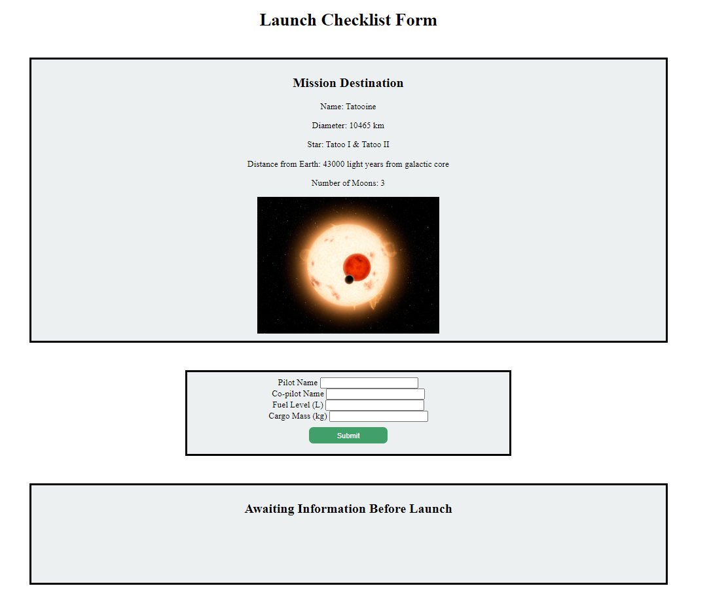
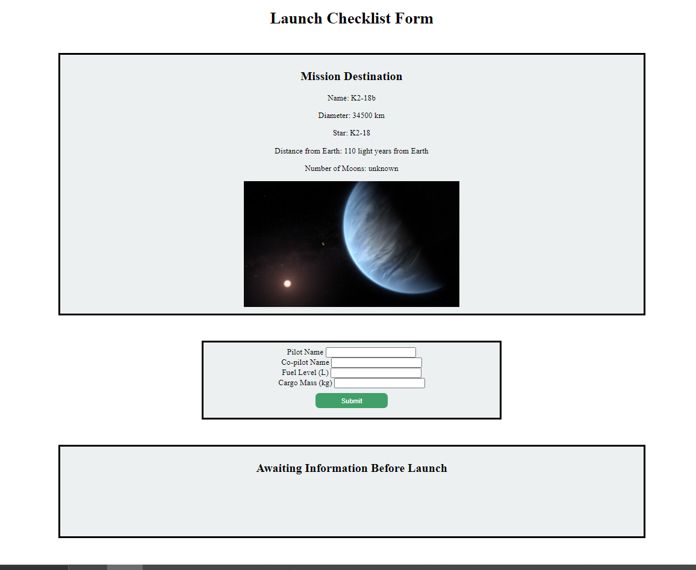
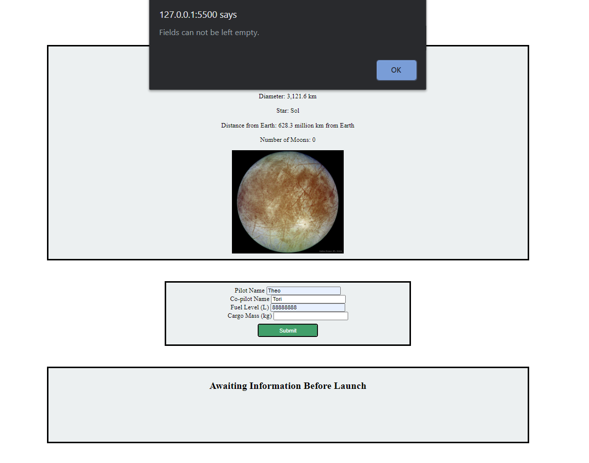
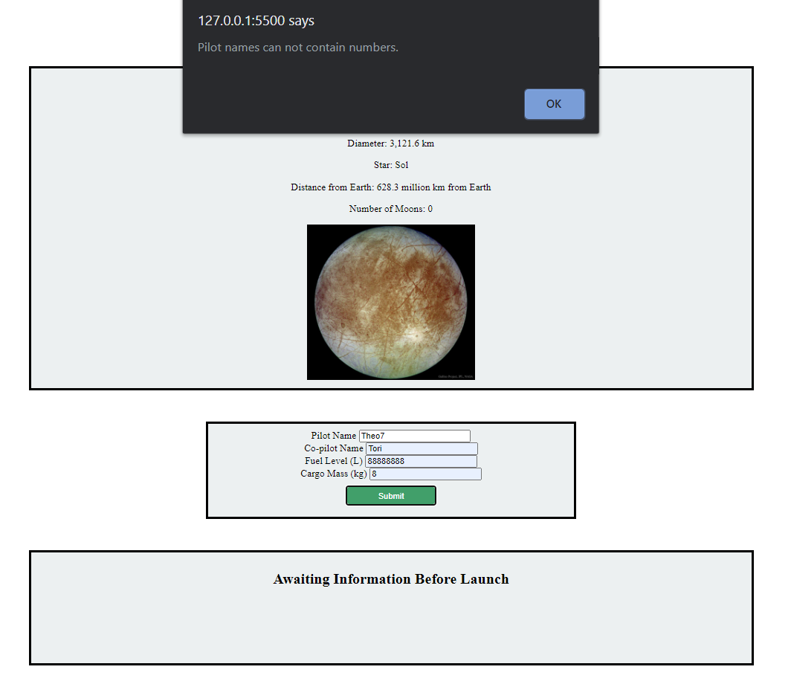
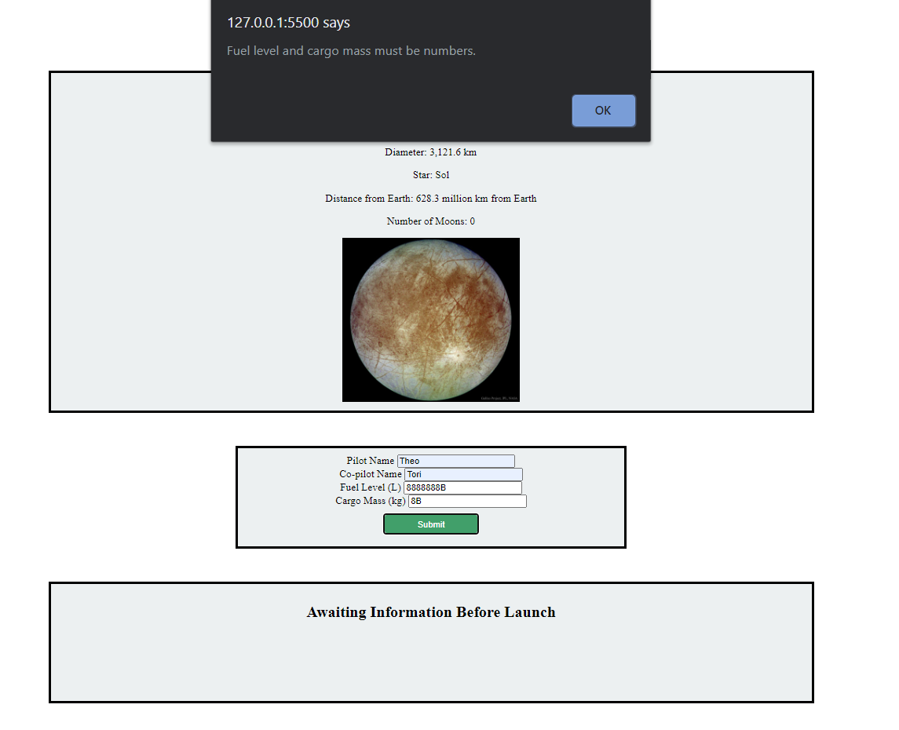
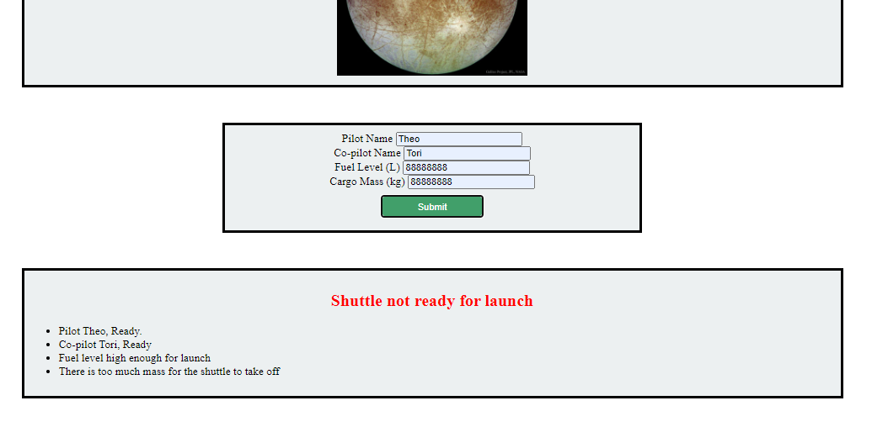
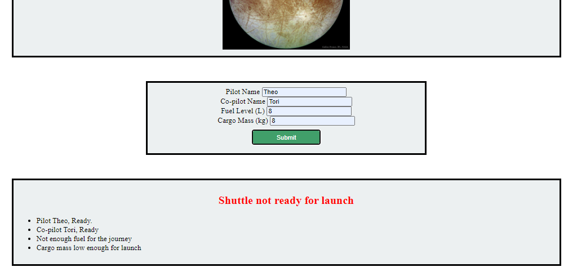

An HTML and JavaScript form that validates whether or not your hypothetical spaceship is ready for launch to a random planet.

*This program was a homework assignment at LaunchCode's Lc101 (2019)*

## Random Planet 1

## Random Planet 2

## Empty Field

## Invalid Pilot Name(s)

## Numbers in Cargo and/or Fuel Data

## Too Much Mass

## Not Enough Fuel

